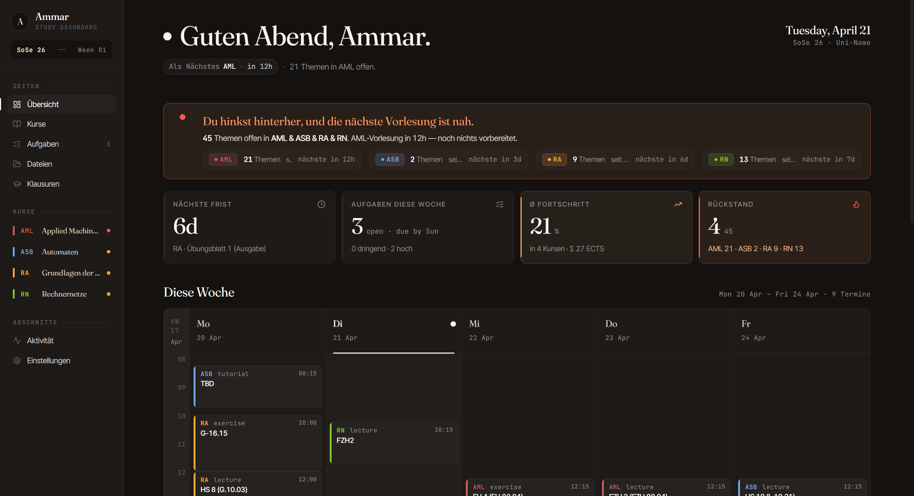
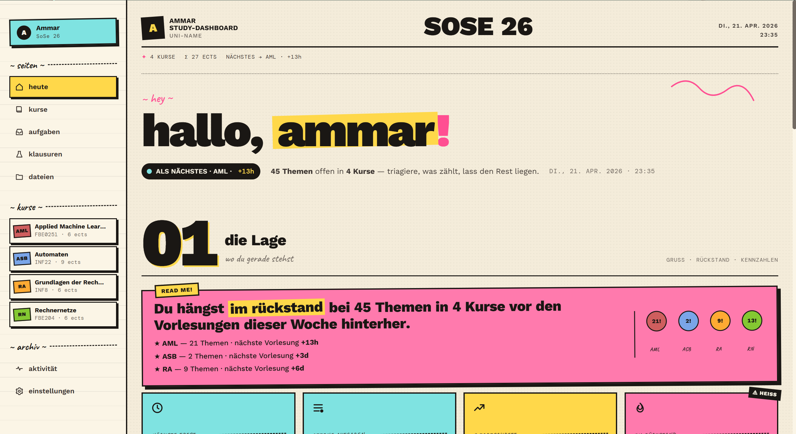
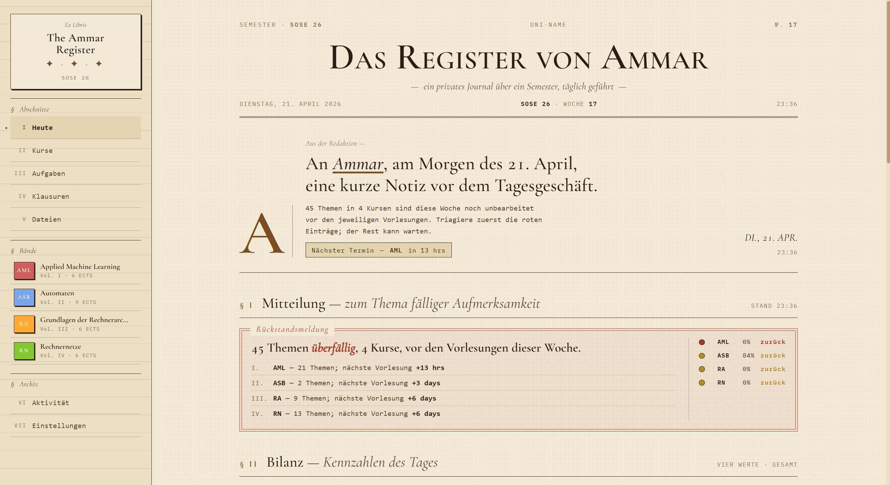
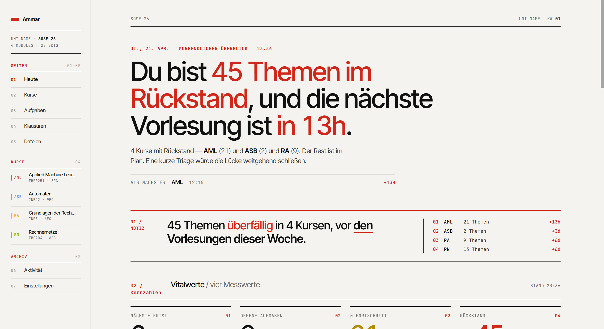
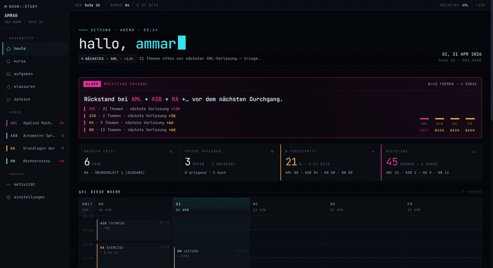

[](https://mseep.ai/app/openstudy-dev-openstudy)

<p align="right"><sub><a href="#deutsch">🇩🇪 Auf Deutsch lesen ↓</a></sub></p>

<p align="center">
  <picture>
    <source media="(prefers-color-scheme: dark)" srcset="docs/brand/wordmark/on-dark.svg">
    
  </picture>
</p>

A self-hostable personal study dashboard. Track your **courses, schedule, lectures, study topics, deliverables, and tasks** in one place — and let **your Claude subscription** use OpenStudy from your **browser**, **phone**, **desktop**, or **Claude Code**.


### Five themes — pick the one that fits your brain

<table>
  <tr>
    <td align="center"><strong>Classic</strong><br/><sub>the default — serif, airy, muted</sub></td>
    <td align="center"><strong>Zine</strong><br/><sub>pastel cream + hand-drawn stickers</sub></td>
  </tr>
  <tr>
    <td></td>
    <td></td>
  </tr>
  <tr>
    <td align="center"><strong>Library</strong><br/><sub>cream paper + sepia, card-catalog aesthetic</sub></td>
    <td align="center"><strong>Swiss</strong><br/><sub>12-column grid + red accent, Helvetica-era</sub></td>
  </tr>
  <tr>
    <td></td>
    <td></td>
  </tr>
</table>

**Terminal** — mono everywhere, teal-on-black, hacker cockpit:


Switch between all five in **Settings → Theme**. Each one is a full reskin of the dashboard, sidebar, and typography — not just a color palette.

### Demo — Claude reading a lecture PDF straight out of OpenStudy


That's **claude.ai in the browser**, with the OpenStudy MCP server connected as a custom connector. No file was uploaded into the chat — Claude calls `list_course_files` to find the PDF **inside OpenStudy's own file store**, then `read_course_file` renders each page to a PNG and streams it back as vision input. Claude answers questions about the lecture while the PDF never leaves your self-hosted instance.

## How I use this

### The one-time seed

Before any of the day-to-day stuff, I had to get a semester's worth of courses, schedules, exam rules, and lecture material into the app. I didn't want to do that by hand and I didn't want to write a bespoke import script, so I let Claude Code do it:

1. **Pulled everything off my university's LMS *(Moodle, in my case)* into a local folder.** For each course I downloaded the syllabus, schedule, the professor's organizational slides, existing exercise sheets, and the official module catalogue. Structure on disk:

   ```
   Semester 4/
     semester.md              # one-liner per course, semester dates, links
     schedule.md              # weekly schedule (my source of truth)
     module-catalogue.pdf
     ASB/
       course.md              # structured source-of-truth (see below)
       00_introduction.pdf    # prof's org slides
       exercise-sheets/
     Computer-Architecture/
       course.md
       1 Intro und History.pdf
       ...
     ...
   ```

2. **Had Claude Code build one `course.md` per course.** It read every PDF, the LMS copy, and the module catalogue entry, and produced a normalized markdown with a `Meta` table (official name, module code, ECTS, professor, language, exam format, retries, weight), the weekly schedule in the prof's own words, and any grading rules / attendance requirements (e.g. "lab attendance ≥ 75 % for exam admission"). That file became the course's source of truth — everything else downstream pulls from it.

3. **Seeded the dashboard via the MCP connector.** With Claude Code pointed at the running dashboard over MCP, I asked it to walk through each `course.md` and:
   - `create_course` with the meta (code, full name, color, ECTS, professor, language, and a `folder_name` matching the local folder — so the course-detail **Files** tab scopes to the right prefix in the bucket)
   - `create_schedule_slot` for every recurring slot in `schedule.md` (kind is `lecture` / `exercise` / `tutorial` / `lab`)
   - `update_exam` with the exam format + retries
   - `create_deliverable` for every known exercise sheet / project deadline in the semester
   - upload every PDF from each course folder into the `course_files` bucket (so `read_course_file` can hand them to Claude as vision later)

   > If you don't want to keep a local `Semester 4/` folder at all, every PDF upload can also happen from inside the app — drag-and-drop into the **Files** view. The local folder is just what works for me because I'm already downloading the files anyway.

4. **Opened the dashboard → everything was there.** Weekly grid populated, four courses with accents, exam info per course, every exercise sheet showing up in the deadlines list.

**From then on it's incremental.** New lectures land on the LMS, I either drop the PDFs into the corresponding `Semester 4/<course>/` folder on my laptop (Claude Code picks them up and uploads) or drag-and-drop them straight into the app's **Files** view. If the `course.md` needs an update (new grading rule announced, exam date confirmed, topic added), Claude edits the markdown *and* pushes the change through the MCP (`update_course`, `update_exam`, etc.) so the dashboard and the source-of-truth stay aligned.

### A typical week

**During the lecture itself.** The prof introduces a topic I want more depth on without losing the thread of where the lecture is. I open Claude on my phone: *"I'm in ASB lecture 4, slide 12 on the pumping lemma — expand on the intuition for why it works, complement what the prof is saying with more detail."* Claude calls `list_course_files`, finds the ASB lecture 4 slides, uses `read_course_file` to fetch *just page 12*, reads the prof's actual definition, and explains from there — in sync with what I'm actually seeing on the projector.

**Right after a lecture.** Walking out of class, I open Claude on my phone: *"We just finished lecture 4 of ASB, covered pumping lemma, closure properties, and non-regularity of aⁿbⁿ."* Claude creates the lecture #4, adds the study topics with proper descriptions linked to lecture #4, marks it attended. couple of seconds. The dashboard is caught up.

**Later that day, I drop the slides in.** I upload the slides of the lecture to the app. Claude can now fetch and read the slides on demand (Through the MCP) and use them to teach me. (it can also fetch only the pages of the slides it needs to teach me, so it doesn't have to read the whole PDF).

**Evening, sitting down to actually study.** *"Am I falling behind in anything?"* Claude pulls the fall-behind list — *"3 ASB topics unstudied, next lecture in 7h."* I pick the first one:

> *"Walk me through pumping lemma §2.4. Pull the ASB lecture 4 slides and use the actual definition and example from there. Ask me a check question halfway through."*

Claude calls `list_study_topics` to find the topic row, `list_course_files` + `read_course_file` to fetch the slides (pages rendered to PNGs — Claude literally sees them, not OCR text), then teaches from the prof's slide wording. When it hits the check question I answer, it either corrects me or moves on. When I confirm I've got it: *"mark §2.4 studied,"* and Claude calls `mark_studied`.

Then the next topic. Same loop. The "3 unstudied" count on the dashboard ticks down in real time.

**Before bed, planning tomorrow.** *"What's due this week?"* One list, sorted by due date. *"Add a task: finish ASB Blatt 3 by Monday 16:00, high priority."* Done.

**On the dashboard itself.** Everything Claude did — the lecture, the topics, the mark-studied, the task — is already there when I open the UI. The *falling-behind* banner only fires when I have unstudied topics and the next lecture on them is close. The weekly grid shows what's coming. Course cards show per-course progress. I don't have to tell the dashboard what I did because Claude already did.

The dashboard is where I see things. Claude is how I edit them. Same database behind both. (You can also use the dashboard UI to edit things, of course, It does have CRUD operations for everything).

## What makes it different

The MCP server ships with **44 tools — anything you can do in the UI, Claude can do too**. Create a study topic, mark something studied, upload a file, render a PDF as images, whatever.

Plug it into Claude.ai as a custom connector (full OAuth 2.1) and those tools are live in **Claude Code on your laptop, claude.ai in your browser, and the Claude iOS app on your phone**. Open Claude anywhere and it has the same view of your coursework that you do.

## You'll need

Before you start, have:

- **Docker** + **Docker Compose v2.30+** (the stack — Postgres, FastAPI, frontend — all run as containers)
- **Node 20+** and **pnpm** (via [corepack](https://pnpm.io/installation#using-corepack)) for building the frontend
- A **public hostname pointing at your box** if you want Claude.ai or the Claude iOS app to reach the MCP endpoint (Claude Code can use `localhost`)
- **~15 minutes** for first-time setup

The whole stack — Postgres, the FastAPI backend, and the static frontend — runs on a single box. Anything that runs Docker works: a €5/mo VPS is plenty.

## Quick start

Get the full stack running locally. The frontend is built once and served by Caddy in production; for development, run it with `pnpm dev` against the dockerised backend.

**1. Clone + install frontend deps.**

```bash
git clone https://github.com/openstudy-dev/OpenStudy
cd OpenStudy
cd web && pnpm install && cd ..
```

**2. Generate secrets and write `.env` files.**

```bash
cp .env.example .env

# Pick a login password, hash it with Argon2id, and paste the result as APP_PASSWORD_HASH:
docker run --rm python:3.12-slim sh -c 'pip install -q argon2-cffi && python -c "from argon2 import PasswordHasher; print(PasswordHasher().hash(input(\"password: \")))"'

# Generate a 48-byte session secret and paste as SESSION_SECRET:
python -c 'import secrets; print(secrets.token_urlsafe(48))'

# Generate a Postgres password and write the Docker-only env file:
cat > .env.docker <<EOF
POSTGRES_USER=openstudy
POSTGRES_PASSWORD=$(openssl rand -hex 24)
POSTGRES_DB=openstudy
EOF
chmod 600 .env.docker
```

`.env` holds your application secrets (password hash, session secret, optional Telegram tokens). `.env.docker` holds the Postgres credentials that compose injects into the postgres container. Both are in `.gitignore`.

**3. Bring up the stack.**

```bash
./deploy.sh
```

`deploy.sh` validates compose, builds the openstudy image, applies any pending migrations against the Postgres container, starts everything, then polls `GET /api/health` for up to 60 s. If health doesn't go green it auto-rolls back to the previously deployed image.

The backend is now live at `http://127.0.0.1:8000`. Verify:

```bash
curl http://127.0.0.1:8000/api/health
# → {"ok":true,"version":"...","db":"ok","storage":"ok ..."}
```

**4. Use it.**

The frontend is also a container — `./deploy.sh` brought it up at
`http://127.0.0.1:8080`. Open that in your browser and log in with the
password you hashed. For a public domain, just point your reverse proxy
(Caddy / nginx / etc.) at `127.0.0.1:8080` — the in-container Caddy
handles routing static assets vs. proxying API/MCP traffic.

For local frontend development with Vite hot-reload:

```bash
echo "VITE_API_BASE_URL=http://localhost:8000" > web/.env.local
cd web && pnpm dev   # → http://localhost:5173
```

Stuck or want the production checklist? Full walkthrough is in **[INSTALL.md](./INSTALL.md)**.

## What you do inside the app

On first boot, everything's empty. You build it up in the UI (or via Claude through the MCP connector):

1. **Settings → Profile**: name, monogram, institution
2. **Settings → Semester**: label (e.g. "Fall 2026"), start/end dates, timezone, locale
3. **Courses → +**: create each course with a short code (ASB, CS101…), a full name, and an accent color
4. **Course detail**: add schedule slots (weekday / time / room), upcoming deliverables, and the study topics you're expected to cover
5. **Dashboard**: lives here. Greeting, *falling-behind* banner, metric tiles, weekly grid, course cards, deadlines + tasks.

## The MCP connector

> **Prerequisite: the app needs to be reachable at a public URL.** Claude.ai and the iOS app can't talk to `localhost` — so put the box behind a domain with TLS (Caddy + Let's Encrypt does this in two lines of config). Claude Code is the exception: it can hit `http://localhost:8000/mcp` directly.

Once the app is live at `https://your-domain.tld`, it serves a Streamable HTTP MCP endpoint at `/mcp`, OAuth-gated. One endpoint, every client:

```bash
# Claude.ai (browser + iOS app): Settings → Connectors → Add custom connector
#   paste: https://your-domain.tld/mcp

# Claude Code (local CLI, any directory):
claude mcp add --transport http --scope user \
  openstudy https://your-domain.tld/mcp
```

Both flows open your dashboard's login in a browser for the one-time OAuth consent. After that, the same 44 tools are live wherever you use Claude:

- *"list my courses"* / *"what's due this week?"* / *"what did we cover in RN last week?"*
- *"we just finished lecture 3 of ASB, we covered topics X, Y, Z — create the lecture and topics"* → Claude calls `create_lecture` + `add_lecture_topics`
- *"mark chapter §1.4 as studied"* → `list_study_topics` + `mark_studied`
- *"open the ASB lecture 2 slides and tell me what §0.1.3 is about"* → `list_course_files` + `read_course_file` (PDFs are rendered to PNGs and streamed back as vision — Claude literally sees the slides)
- *"I'm falling behind in AML, help me prioritise"* → `get_fall_behind` + plan

**Claude.ai Projects** get a bigger quality boost when you paste a tailored system prompt alongside the connector. Template: [`docs/claude-ai-system-prompt.md`](./docs/claude-ai-system-prompt.md).

Full walkthrough (including curl-based verification): [`INSTALL.md#7-connect-an-mcp-client`](./INSTALL.md#7-connect-an-mcp-client).

## What's in here

```
app/                FastAPI + MCP server (Python, uv-managed)
  routers/          HTTP endpoints
  services/         Database queries + business logic
  mcp_tools.py      The MCP tools
  schemas.py        Pydantic models
migrations/         SQL files run by scripts/run_migrations.py at deploy time
  00000000000000_baseline.sql  Initial schema; new migrations stack on top
web/
  src/              Vite + React 19 + Tailwind + shadcn/ui frontend
scripts/
  run_migrations.py Idempotent migration runner with checksum tracking
docker-compose.yml  Postgres + FastAPI on an internal network
Dockerfile          Builds the openstudy:latest image
deploy.sh           Build → migrate → roll → health-gate → rollback-on-fail
docs/
  claude-ai-system-prompt.md    Template + walkthrough for a Claude.ai Project
  examples/                     Real lived-in versions, including the brief that produced this UI
```

## Stack

Three containers behind a single host-side reverse proxy:

- **Frontend:** Vite + React 19 + TypeScript + Tailwind + shadcn/ui, built into a Caddy:alpine image that serves the SPA and proxies API traffic to the backend on the internal docker network
- **Backend:** FastAPI (Python 3.12) running as one uvicorn worker, talking to Postgres directly via `psycopg` async pool
- **Data:** Postgres 16 (internal-network only — never exposed to the host)
- **Files:** plain filesystem under `STUDY_ROOT` (default `/opt/courses`), bind-mounted into the FastAPI container
- **MCP:** Python `mcp` SDK, mounted at `/mcp` over Streamable HTTP with OAuth 2.1
- **Hosting:** anywhere Docker runs — bring your own outer reverse proxy (Caddy in [INSTALL.md](./INSTALL.md)) for TLS termination

## Design

The visual design was prototyped in [Claude Design](https://claude.ai/design). The brief that produced this UI is at [`docs/examples/design-brief-example.md`](./docs/examples/design-brief-example.md).

## License

MIT — do whatever you like. Credit / a star / a link back is appreciated but not required.

## Contributing

**Yes, please.** If you self-host this and something breaks, something feels off, or you wish it did one more thing — open an issue or a PR. No ceremony. Typo fixes, a clearer sentence in INSTALL.md, a new MCP tool you wrote for your own use, a CSS tweak that makes the mobile layout less cramped — all welcome.

If you're unsure whether a bigger change is in scope, a quick *"would you take a PR that does X?"* issue is the easy way to find out.

Full contributor notes (setup, style, testing, what's likely in vs. out of scope) live in [CONTRIBUTING.md](./CONTRIBUTING.md).

---

<a id="deutsch"></a>

<details>
<summary><b>🇩🇪 Auf Deutsch lesen</b></summary>

<br>

Ein self-hostbares, persönliches Studien-Dashboard. Behalte deine **Kurse, deinen Stundenplan, Vorlesungen, Lernthemen, Abgaben und Aufgaben** an einem Ort im Blick — und lass **Claude** die App aus deinem **Browser**, vom **Handy**, vom **Desktop** oder aus **Claude Code** heraus bedienen.

### Fünf Themes — such dir das aus, das zu deinem Kopf passt

<table>
  <tr>
    <td align="center"><strong>Klassisch</strong><br/><sub>der Standard — Serif, luftig, gedeckt</sub></td>
    <td align="center"><strong>Zine</strong><br/><sub>Pastell-Creme + handgemachte Sticker</sub></td>
  </tr>
  <tr>
    <td></td>
    <td></td>
  </tr>
  <tr>
    <td align="center"><strong>Bibliothek</strong><br/><sub>Creme-Papier + Sepia, Karteikasten-Ästhetik</sub></td>
    <td align="center"><strong>Swiss</strong><br/><sub>12-Spalten-Raster + rot akzentuiert, Helvetica-Ära</sub></td>
  </tr>
  <tr>
    <td></td>
    <td></td>
  </tr>
</table>

**Terminal** — Monospace überall, Türkis auf Schwarz, Hacker-Cockpit:



Unter **Einstellungen → Theme** zwischen allen fünf wechseln. Jedes ist ein vollständiger Reskin von Dashboard, Sidebar und Typografie — nicht bloss eine andere Farbpalette.

### Demo — Claude liest ein Vorlesungs-PDF direkt aus OpenStudy


Das ist **claude.ai im Browser**, mit dem OpenStudy-MCP-Server als Custom Connector angebunden. Es wurde nichts in den Chat hochgeladen — Claude ruft `list_course_files` auf, um das PDF **im Dateispeicher von OpenStudy selbst** zu finden, dann rendert `read_course_file` jede Seite als PNG und schickt sie als Vision-Input zurück. Claude beantwortet Fragen zur Vorlesung, ohne dass das PDF je deine selbst gehostete Instanz verlässt.

## Wie ich das benutze

### Der einmalige Seed

Bevor der Alltag losgeht, musste ich erst mal ein ganzes Semester an Kursen, Stundenplänen, Prüfungsregeln und Vorlesungsmaterial in die App bekommen. Per Hand hatte ich keine Lust, ein eigenes Import-Skript wollte ich auch nicht schreiben — also hat Claude Code das für mich gemacht:

1. **Alles vom LMS der Uni *(Moodle, in meinem Fall)* in einen lokalen Ordner gezogen.** Pro Kurs habe ich die Modulbeschreibung, den Stundenplan, die Organisations-Folien der Professorin, bestehende Übungsblätter und das offizielle Modulhandbuch heruntergeladen. Struktur auf der Platte:

   ```
   Semester 4/
     semester.md              # Ein-Zeiler pro Kurs, Semesterdaten, Links
     schedule.md              # Wochenstundenplan (meine Source of Truth)
     module-catalogue.pdf     # (Modulhandbuch)
     ASB/
       course.md              # strukturierte Source of Truth (siehe unten)
       00_introduction.pdf    # Org-Folien der Professorin
       exercise-sheets/       # (Übungsblätter)
     Computer-Architecture/   # (Rechnerarchitektur)
       course.md
       1 Intro und History.pdf
       ...
     ...
   ```

2. **Claude Code hat pro Kurs eine `course.md` gebaut.** Es hat jedes PDF, die LMS-Kopie *(Moodle)* und den Modulhandbuch-Eintrag gelesen und daraus ein normalisiertes Markdown produziert — mit einer `Meta`-Tabelle (offizieller Name, Modulcode, ECTS, Dozent:in, Sprache, Prüfungsformat, Versuche, Gewichtung), dem Wochenstundenplan in den eigenen Worten der Professorin und allen Bewertungs- bzw. Anwesenheitsregeln (z. B. „Praktikum-Anwesenheit ≥ 75 % für Klausurzulassung"). Diese Datei wurde pro Kurs zur Source of Truth — alles Weitere zieht daraus.

3. **Das Dashboard über den MCP-Connector befüllt.** Mit Claude Code am laufenden Dashboard angedockt, habe ich es jede `course.md` durchgehen lassen, um:
   - `create_course` mit den Metadaten aufzurufen (Kürzel, voller Name, Farbe, ECTS, Dozent:in, Sprache und ein `folder_name`, der dem lokalen Ordner entspricht — damit der **Files**-Tab der Kursdetailseite das richtige Präfix im Bucket filtert)
   - `create_schedule_slot` für jeden wiederkehrenden Termin aus `schedule.md` (`kind` ist `lecture` / `exercise` / `tutorial` / `lab`)
   - `update_exam` mit Prüfungsformat + Versuchszahl
   - `create_deliverable` für jede bekannte Übungsblatt-/Projekt-Deadline im Semester
   - jedes PDF aus den Kursordnern in den `course_files`-Bucket hochzuladen (damit `read_course_file` sie Claude später als Vision übergeben kann)

   > Wenn du den lokalen `Semester 4/`-Ordner gar nicht haben willst, kann jedes PDF stattdessen direkt in der App landen — per Drag-and-Drop in die **Files**-Ansicht. Der lokale Ordner passt für mich nur deshalb, weil ich die Dateien eh schon runterlade.

4. **Dashboard geöffnet → alles war da.** Wochenraster gefüllt, vier Kurse mit eigenen Akzentfarben, Klausur-Infos pro Kurs, jedes Übungsblatt in der Deadline-Liste.

**Ab da läuft es inkrementell weiter.** Neue Vorlesungen landen auf dem LMS *(Moodle)*, ich lege die PDFs entweder in den passenden `Semester 4/<kurs>/`-Ordner auf dem Laptop (Claude Code zieht sie rauf) oder schiebe sie direkt per Drag-and-Drop in die **Files**-Ansicht. Wenn die `course.md` ein Update braucht (neue Bewertungsregel, fixer Klausurtermin, neues Thema), bearbeitet Claude das Markdown *und* schickt die Änderung über MCP durch (`update_course`, `update_exam` usw.), damit Dashboard und Source of Truth synchron bleiben.

### Eine typische Woche

**Während der Vorlesung selbst.** Der Prof führt ein Thema ein, bei dem ich mehr Tiefe will, ohne den Faden der Vorlesung zu verlieren. Ich öffne Claude auf dem Handy: *„Ich bin gerade in ASB VL 4, Folie 12 zum Pumping-Lemma — vertief die Intuition dahinter, ergänze, was der Prof gerade sagt, mit mehr Details."* Claude ruft `list_course_files` auf, findet die ASB-VL-4-Folien, holt mit `read_course_file` *genau Seite 12*, liest die eigentliche Definition des Profs und erklärt von dort aus — synchron mit dem, was gerade auf dem Beamer steht.

**Direkt nach der Vorlesung.** Auf dem Weg aus dem Hörsaal öffne ich Claude auf dem Handy: *„Wir haben gerade VL 4 von ASB beendet, es ging um das Pumping-Lemma, Abschlusseigenschaften und die Nicht-Regularität von aⁿbⁿ."* Claude legt die Vorlesung #4 an, erzeugt die Lernthemen mit ordentlichen Beschreibungen verknüpft mit Vorlesung #4 und markiert sie als besucht. Ein paar Sekunden. Das Dashboard ist up-to-date.

**Später am Tag lade ich die Folien hoch.** Ich schiebe die Folien der Vorlesung in die App. Claude kann sie dann bei Bedarf über MCP ziehen und mir damit Inhalte erklären. (Es kann sich sogar nur die Seiten holen, die es gerade braucht — es muss also nicht das ganze PDF lesen.)

**Abends, wenn ich mich zum Lernen setze.** *„Wo hänge ich gerade hinterher?"* Claude zieht die Fall-behind-Liste — *„3 ASB-Themen unstudied, nächste Vorlesung in 7 h."* Ich picke mir das erste:

> *„Erklär mir das Pumping-Lemma §2.4. Zieh die ASB-VL4-Folien und nutze die exakte Definition + das Beispiel von dort. Stell mir auf halber Strecke eine Checkfrage."*

Claude ruft `list_study_topics` auf, um das Themenrow zu finden, dann `list_course_files` + `read_course_file` für die Folien (Seiten als PNG gerendert — Claude *sieht* die Folien wirklich, kein OCR-Text), und erklärt dann mit den Formulierungen der Professorin. Kommt die Checkfrage, antworte ich, und Claude korrigiert oder geht weiter. Wenn ich's raus habe: *„markier §2.4 als studied"* — Claude ruft `mark_studied`.

Dann das nächste Thema. Gleicher Loop. Die *„3 unstudied"*-Zahl auf dem Dashboard tickt live runter.

**Vor dem Schlafen, Plan für morgen.** *„Was ist diese Woche fällig?"* Eine Liste, nach Deadline sortiert. *„Leg eine Aufgabe an: ASB Blatt 3 bis Montag 16:00, hohe Priorität."* Done.

**Auf dem Dashboard selbst.** Alles, was Claude gemacht hat — die Vorlesung, die Themen, das Mark-Studied, die Aufgabe — ist beim Öffnen der UI schon da. Der *Falling-behind*-Banner erscheint nur, wenn ich unstudierte Themen habe UND die nächste Vorlesung dazu näherrückt. Das Wochenraster zeigt, was ansteht. Die Kurskarten zeigen den Lernfortschritt pro Kurs. Ich muss dem Dashboard nichts erzählen, weil Claude schon alles gepflegt hat.

Das Dashboard ist, wo ich Dinge sehe. Claude ist, wie ich sie bearbeite. Dieselbe Datenbank hinter beidem. (Die Dashboard-UI kann natürlich auch alles selbst — CRUD gibt es für alles.)

## Was es ausmacht

Der MCP-Server bringt **44 Tools — alles, was du in der UI machen kannst, kann Claude auch**. Lernthema anlegen, etwas als studied markieren, eine Datei hochladen, ein PDF als Bilder rendern, was auch immer.

Stöpsel den Connector in Claude.ai (voller OAuth 2.1) und dieselben Tools sind in **Claude Code auf dem Laptop, Claude.ai im Browser und der Claude-iOS-App auf dem Handy** live. Egal wo du Claude öffnest — es hat denselben Blick auf deinen Studienalltag wie du.

## Was du brauchst

Bevor es losgeht, solltest du haben:

- **Docker** + **Docker Compose v2.30+** (der ganze Stack — Postgres, FastAPI-Backend, Frontend — läuft als Container)
- **Node 20+** und **pnpm** (via [corepack](https://pnpm.io/installation#using-corepack)) zum Bauen des Frontends
- Einen **öffentlichen Hostnamen, der auf deine Box zeigt**, falls Claude.ai oder die Claude-iOS-App den MCP-Endpoint erreichen sollen (Claude Code geht auch mit `localhost`)
- **~15 Minuten** fürs erste Setup

Der komplette Stack — Postgres, FastAPI-Backend, statisches Frontend — läuft auf einer einzigen Box. Alles, worauf Docker läuft, reicht: ein 5 €/Monat-VPS hat genug Power.

## Quick Start

Den ganzen Stack lokal hochfahren. Das Frontend wird einmal gebaut und in Production von Caddy ausgeliefert; in der Entwicklung läuft es per `pnpm dev` gegen das dockerisierte Backend.

**1. Klonen + Frontend-Deps installieren.**

```bash
git clone https://github.com/openstudy-dev/OpenStudy
cd OpenStudy
cd web && pnpm install && cd ..
```

**2. Secrets generieren und `.env`-Dateien schreiben.**

```bash
cp .env.example .env

# Login-Passwort wählen, mit Argon2id hashen und als APP_PASSWORD_HASH einfügen:
docker run --rm python:3.12-slim sh -c 'pip install -q argon2-cffi && python -c "from argon2 import PasswordHasher; print(PasswordHasher().hash(input(\"password: \")))"'

# 48-Byte-Session-Secret generieren und als SESSION_SECRET einfügen:
python -c 'import secrets; print(secrets.token_urlsafe(48))'

# Postgres-Passwort generieren und die Docker-spezifische env-Datei schreiben:
cat > .env.docker <<EOF
POSTGRES_USER=openstudy
POSTGRES_PASSWORD=$(openssl rand -hex 24)
POSTGRES_DB=openstudy
EOF
chmod 600 .env.docker
```

`.env` enthält deine App-Secrets (Passwort-Hash, Session-Secret, optional Telegram-Tokens). `.env.docker` enthält die Postgres-Credentials, die Compose in den Postgres-Container injiziert. Beide sind in `.gitignore`.

**3. Stack starten.**

```bash
./deploy.sh
```

`deploy.sh` validiert Compose, baut das `openstudy`-Image, wendet alle ausstehenden Migrationen gegen den Postgres-Container an, startet alles und pollt dann `GET /api/health` für bis zu 60 s. Wenn Health nicht grün wird, rollt es automatisch auf das vorherige Image zurück.

Das Backend läuft jetzt unter `http://127.0.0.1:8000`. Verifizieren:

```bash
curl http://127.0.0.1:8000/api/health
# → {"ok":true,"version":"...","db":"ok","storage":"ok ..."}
```

**4. Loslegen.**

Das Frontend ist auch ein Container — `./deploy.sh` hat es unter
`http://127.0.0.1:8080` hochgefahren. Öffne das im Browser und logg
dich mit dem gehashten Passwort ein. Für eine öffentliche Domain
einfach deinen Reverse Proxy (Caddy / nginx / etc.) auf `127.0.0.1:8080`
zeigen lassen — der Caddy im Container kümmert sich um die Aufteilung
zwischen statischen Assets und API/MCP-Traffic.

Für lokale Frontend-Entwicklung mit Vite-Hot-Reload:

```bash
echo "VITE_API_BASE_URL=http://localhost:8000" > web/.env.local
cd web && pnpm dev   # → http://localhost:5173
```

Hängen geblieben oder Production-Checkliste gewünscht? Vollständiger Walkthrough in **[INSTALL.md](./INSTALL.md)** (auf Englisch).

## Was du in der App tust

Beim ersten Start ist alles leer. Du baust es in der UI auf (oder über Claude + MCP-Connector):

1. **Settings → Profile**: Name, Monogramm, Institution
2. **Settings → Semester**: Label (z. B. „SoSe 2026"), Start-/Enddatum, Zeitzone, Locale
3. **Courses → +**: pro Kurs ein Kürzel (ASB, CS101 …), vollen Namen, Akzentfarbe
4. **Course detail**: Stundenplan-Slots (Wochentag / Zeit / Raum), anstehende Abgaben, Lernthemen
5. **Dashboard**: wohnt hier. Begrüßung, *Falling-behind*-Banner, Kennzahlen-Kacheln, Wochenraster, Kurskarten, Deadlines + Aufgaben.

## Der MCP-Connector

> **Voraussetzung: die App braucht eine öffentliche URL.** Claude.ai und die iOS-App können nicht auf `localhost` zugreifen — also die Box hinter eine Domain mit TLS stellen (Caddy + Let's Encrypt erledigt das in zwei Zeilen Config). Claude Code ist die Ausnahme: es kann `http://localhost:8000/mcp` direkt erreichen.

Sobald die App unter `https://your-domain.tld` läuft, stellt sie einen Streamable-HTTP-MCP-Endpoint unter `/mcp` bereit, OAuth-geschützt. Ein Endpoint, jeder Client:

```bash
# Claude.ai (Browser + iOS-App): Settings → Connectors → Add custom connector
#   einfügen: https://your-domain.tld/mcp

# Claude Code (lokales CLI, jedes Verzeichnis):
claude mcp add --transport http --scope user \
  openstudy https://your-domain.tld/mcp
```

Beide Flows öffnen den Login deines Dashboards im Browser fürs einmalige OAuth-Consent. Danach sind dieselben 44 Tools überall verfügbar, wo du Claude nutzt:

- *„list meine Kurse"* / *„was ist diese Woche fällig?"* / *„was haben wir letzte Woche in RN gemacht?"*
- *„wir sind mit VL 3 von ASB fertig, wir haben X, Y, Z behandelt — leg die Vorlesung und die Themen an"* → Claude ruft `create_lecture` + `add_lecture_topics`
- *„markier Kapitel §1.4 als studied"* → `list_study_topics` + `mark_studied`
- *„öffne die ASB-VL2-Folien und sag mir, worum es in §0.1.3 geht"* → `list_course_files` + `read_course_file` (PDFs werden als PNG gerendert und als Vision zurückgegeben — Claude sieht die Folien wirklich)
- *„ich hänge in AML hinterher, hilf mir priorisieren"* → `get_fall_behind` + Plan

**Claude.ai-Projects** werden deutlich besser, wenn du zusätzlich zum Connector einen passenden System-Prompt einfügst. Vorlage: [`docs/claude-ai-system-prompt.md`](./docs/claude-ai-system-prompt.md).

Vollständiger Walkthrough (inkl. curl-basierter Verifikation): [`INSTALL.md#7-connect-an-mcp-client`](./INSTALL.md#7-connect-an-mcp-client).

## Was hier drin liegt

```
app/                FastAPI + MCP-Server (Python, via uv verwaltet)
  routers/          HTTP-Endpoints
  services/         Datenbank-Queries + Business-Logik
  mcp_tools.py      die MCP-Tools
  schemas.py        Pydantic-Modelle
migrations/         SQL-Dateien, die scripts/run_migrations.py beim Deploy anwendet
  00000000000000_baseline.sql  Initiales Schema; neue Migrationen stapeln darauf
web/
  src/              Vite + React 19 + Tailwind + shadcn/ui Frontend
scripts/
  run_migrations.py Idempotenter Migrations-Runner mit Checksum-Tracking
docker-compose.yml  Postgres + FastAPI auf einem internen Netzwerk
Dockerfile          Baut das openstudy:latest-Image
deploy.sh           Build → Migrate → Roll → Health-Gate → Auto-Rollback
docs/
  claude-ai-system-prompt.md    Vorlage + Walkthrough für ein Claude.ai-Project
  examples/                     echte, gelebte Versionen, inklusive des Briefs, aus dem diese UI entstand
```

## Stack

Drei Container hinter einem einzelnen Reverse Proxy auf dem Host:

- **Frontend:** Vite + React 19 + TypeScript + Tailwind + shadcn/ui, gebaut in ein Caddy:alpine-Image, das die SPA ausliefert und API-Traffic an das Backend im internen Docker-Netzwerk durchreicht
- **Backend:** FastAPI (Python 3.12) als ein uvicorn-Worker, spricht direkt mit Postgres über einen `psycopg`-Async-Pool
- **Daten:** Postgres 16 (nur im internen Netzwerk — nie zum Host exponiert)
- **Dateien:** plain Filesystem unter `STUDY_ROOT` (Default `/opt/courses`), per Bind-Mount in den FastAPI-Container
- **MCP:** Python-`mcp`-SDK, gemountet unter `/mcp` über Streamable HTTP mit OAuth 2.1
- **Hosting:** überall, wo Docker läuft — äußerer Reverse Proxy (Caddy in [INSTALL.md](./INSTALL.md)) übernimmt TLS

## Design

Das visuelle Design wurde in [Claude Design](https://claude.ai/design) prototypt. Das Brief, aus dem diese UI entstanden ist, liegt in [`docs/examples/design-brief-example.md`](./docs/examples/design-brief-example.md).

## Lizenz

MIT — mach damit, was du willst. Credits / ein Star / ein Backlink sind nett, aber nicht Pflicht.

## Mitmachen

**Gerne.** Wenn du das selbst hostest und etwas bricht, etwas sich komisch anfühlt oder du dir eine Sache mehr wünschst — mach ein Issue oder einen PR auf. Kein Zeremoniell. Tippfehler-Fix, ein klarerer Satz in INSTALL.md, ein neues MCP-Tool für deinen eigenen Flow, ein CSS-Tweak, der das mobile Layout entkrampft — alles willkommen.

Wenn du unsicher bist, ob eine größere Änderung im Scope ist, reicht ein kurzes *„würdest du einen PR für X annehmen?"*-Issue.

Vollständige Contributor-Notes (Setup, Stil, Tests, was eher rein- vs. rausfällt) liegen in [CONTRIBUTING.md](./CONTRIBUTING.md).

<p align="center">
  <picture>
    <source media="(prefers-color-scheme: dark)" srcset="docs/brand/logo-wordmark-with-mark-transparent-cream.svg">
    
  </picture>
</p>

</details>
